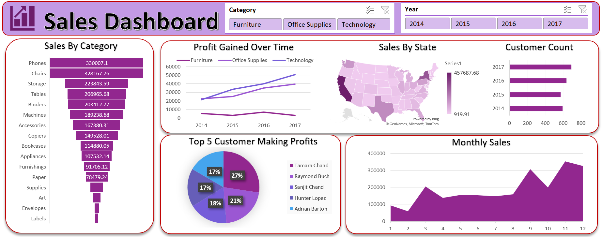

# 📊 Sales Performance Dashboard Using Microsoft Excel

> An interactive and dynamic sales dashboard built using Microsoft Excel to analyze sales trends, customer profits, category performance, and regional sales insights through data visualization techniques.

---

# 📌 Project Overview

This project focuses on transforming raw retail sales data into an interactive Excel dashboard for business analysis and decision-making.

The dashboard helps analyze:
- 📈 Sales Performance
- 💰 Profit Trends
- 🛒 Category-wise Sales
- 🌍 State-wise Sales Analysis
- 👥 Customer Contribution
- 📅 Monthly Sales Trends

Using Excel features like Pivot Tables, Pivot Charts, Slicers, Conditional Formatting, and Dashboard Design, the project delivers meaningful business insights in a visually appealing format.

---

# ❓ Problem Statement

Retail businesses generate large volumes of sales data, making it difficult to manually track performance and identify important trends.

The objective of this project is to:
- Convert raw sales data into actionable insights
- Build an interactive dashboard
- Improve decision-making using visual analysis
- Track sales and profit performance efficiently

---

# 🗂️ Dataset Information

The dataset contains retail sales transaction details such as:

| Column Name | Description |
|---|---|
| Order Date | Date of purchase |
| Customer Name | Name of customer |
| State | Customer state |
| Category | Product category |
| Product | Product name |
| Sales | Sales amount |
| Quantity | Quantity sold |
| Profit | Profit earned |

The raw dataset was cleaned, formatted, and analyzed before dashboard creation.

---

# 🛠️ Tools & Technologies Used

- Microsoft Excel
- Pivot Tables
- Pivot Charts
- Slicers
- Conditional Formatting
- Data Cleaning
- Data Visualization
- Interactive Dashboard Design

---

# ⚙️ Methods Used

The following techniques were used in this project:

✅ Data Cleaning & Formatting  
✅ Pivot Table Analysis  
✅ Sales Aggregation  
✅ Profit Analysis  
✅ Customer Analysis  
✅ State-wise Sales Mapping  
✅ Interactive Filtering using Slicers  
✅ Dashboard Creation & Visualization  

---

# 📈 Dashboard Features

The dashboard includes:

- 📊 Sales By Category Analysis
- 📈 Profit Gained Over Time
- 🌍 State-wise Sales Visualization
- 👥 Top 5 Customers Making Profits
- 📅 Monthly Sales Trend Analysis
- 🎛️ Interactive Slicers for:
  - Category Filtering
  - Year Filtering

---

# 🔍 Key Insights

- 📱 Phones generated the highest sales.
- 🪑 Chairs category showed strong sales performance.
- 💻 Technology category showed continuous profit growth.
- 📅 Sales increased significantly during the final months of the year.
- 🌎 Certain states contributed higher overall sales performance.
- 👥 Top customers generated a significant portion of profits.

---

# 🖼️ Dashboard Preview

<p align="center">
  
</p>

---

# ▶️ How to Run This Project

1. Download the Excel project file.
2. Open the file using Microsoft Excel.
3. Navigate to the **"Sales Dashboard Excel"** sheet.
4. Use slicers to interactively filter:
   - Category
   - Year
5. Analyze trends, profits, customer insights, and regional sales performance.

---

# 📂 Project Structure

```bash
sales-performance-analysis/
│
├── README.md
├── Sales_Performance_Dashboard.xlsx
│
└── screenshots/
    └── dashboard-overview.png
```

---

# ✅ Result & Conclusion

This project successfully transformed raw retail sales data into an interactive business dashboard using Microsoft Excel.

The dashboard helps:
- Monitor business performance
- Track sales trends
- Identify profitable categories
- Analyze customer contribution
- Improve data-driven decision-making

The project demonstrates practical Excel skills used in real-world business and data analysis scenarios.

---

# 📁 Project File

- Sales_Performance_Dashboard.xlsx

---

# 👨‍💻 Author

## Abhishek Chaudhari

---

# 📬 Connect With Me

📧 Gmail  
[abhishek02.tech@gmail.com](mailto:abhishek02.tech@gmail.com)

💼 LinkedIn  
[LinkedIn Profile](https://www.linkedin.com/in/abhishek-chaudhari-12332102gg)

🐙 GitHub  
[abhishekz-tech](https://github.com/abhishekz-tech)
